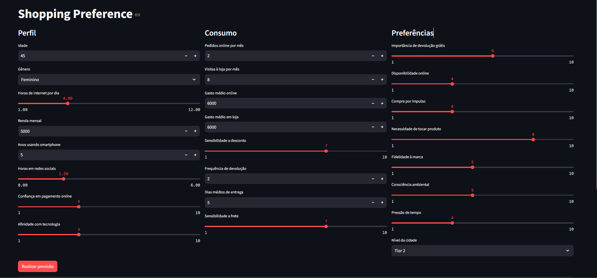
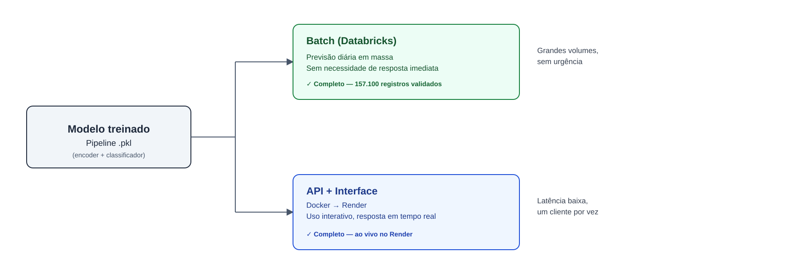
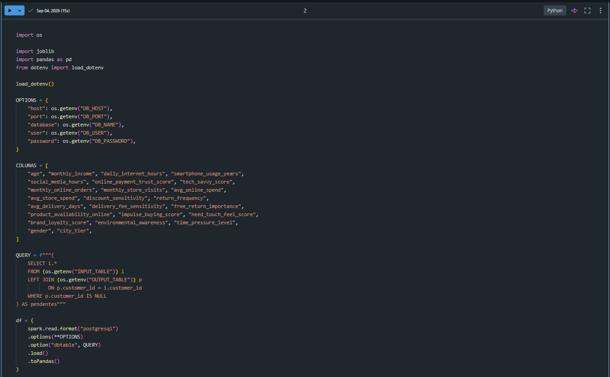
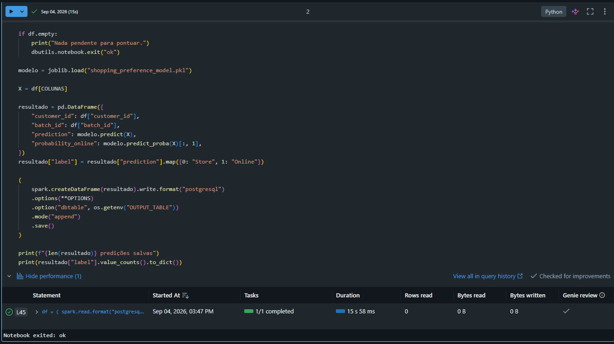
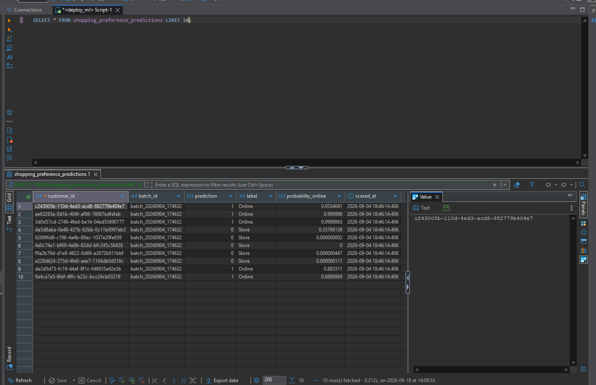
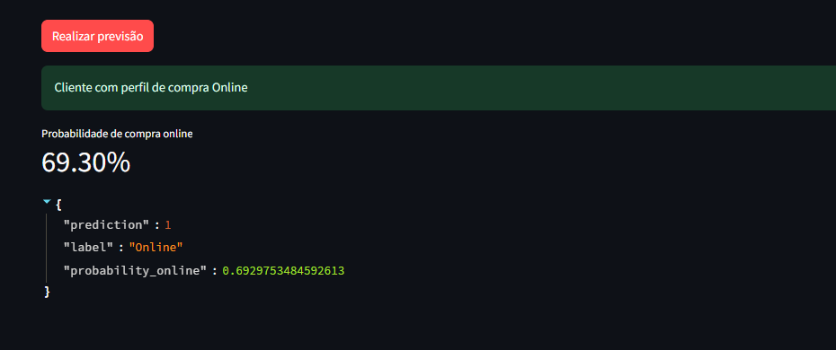
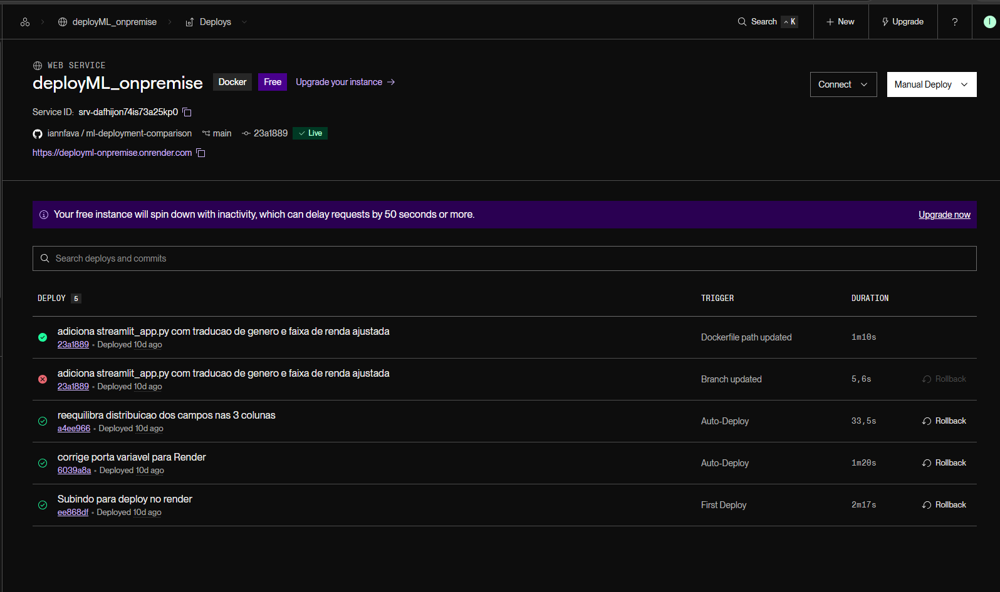

# Deploy de Modelo de ML — 2 Abordagens

Reprodução de um projeto de curso (live com engenheiro de dados + cientista de
dados), com o mesmo modelo de Machine Learning implantado de 2 formas
diferentes — batch agendado e API containerizada — para comparar
arquiteturas de deploy na prática.

🔗 **[Testar o Deploy 2 (API + Interface) ao vivo](https://deployml-onpremise.onrender.com)**

> ⚠️ Hospedado no plano gratuito do Render — a primeira requisição pode levar
> até 1 minuto (cold start). Aguarde o carregamento.
>
> Este é o único dos 2 deploys com uma URL pública interativa — o Deploy 1
> (batch) roda como job agendado, sem interface web.



---

## O problema

Um modelo Scikit-learn (Pipeline com `ColumnTransformer` + `TargetEncoder` +
`LGBMClassifier`) prevê se um cliente tem perfil de compra **Online** ou em
**Loja física**, a partir de 24 variáveis comportamentais e demográficas.

Ter um modelo treinado não é o mesmo que ter um modelo **em produção**. Este
projeto explora essa distância, implantando o mesmo `.pkl` de 2 formas
diferentes, cada uma resolvendo um problema de negócio distinto:

| Deploy | Cenário de uso | Status |
|---|---|---|
| **1. Batch (Databricks)** | Previsão diária em massa, sem necessidade de resposta imediata | ✅ Completo |
| **2. API + Interface (Docker → Render)** | Uso interativo, um cliente por vez, resposta em tempo real | ✅ Completo |



---

## Por que 2 formas de deploy do mesmo modelo?

Cada abordagem resolve um problema de negócio diferente — não existe "a
melhor forma de fazer deploy de ML", existe a forma certa pra cada contexto:

- **Batch** é ideal quando a decisão pode esperar (ex: recalcular a
  probabilidade de todos os clientes uma vez por dia) e o volume de dados é
  grande — processar tudo de uma vez é mais eficiente que uma predição por
  vez.
- **API + Interface** é ideal quando alguém (humano ou outro sistema) precisa
  de uma resposta imediata, unitária, com baixa latência.

---

## Pontos técnicos que se repetem nos 2 deploys

- **Pré-processamento vive dentro do `.pkl`.** O pipeline salvo contém o
  `StandardScaler`/`TargetEncoder` junto com o classificador — nenhum dos
  deploys reimplementa encoding manualmente. Isso evita *training/serving
  skew*: se o pré-processamento fosse reescrito em cada ambiente, qualquer
  pequena diferença de implementação faria o modelo receber dados fora da
  distribuição que aprendeu, gerando previsões erradas sem erro aparente.
- **Versões de bibliotecas fixadas exatamente como no treino** (Python
  3.10.18, scikit-learn 1.7.1, lightgbm 4.6.0, pandas 2.2.3, numpy 2.2.6,
  joblib 1.5.1) — divergência causa falha silenciosa apenas na hora do
  `joblib.load`, já em produção.
- **`joblib.load` sempre no escopo do módulo**, carregado uma única vez na
  inicialização — nunca a cada requisição.
- **Configuração via ambiente** (`.env`, `$PORT`, `API_URL`), nunca
  hardcoded no código.

---

## Notebook de modelagem

O modelo foi construído em notebook, seguindo (resumo — detalhes completos
no notebook):

| Etapa | O que faz |
|---|---|
| Split (holdout) | 20% dos dados isolados desde o início, nunca tocados até a validação final |
| EDA | Auditoria de tipos/missing, sweetviz, sem uso para seleção de features |
| Comparação de baselines | Regressão Logística, HistGradientBoosting, MLP — venceu Regressão Logística |
| Comparação de encoders | TargetEncoder, OneHotEncoder, OrdinalEncoder — empate por baixa cardinalidade |
| Tuning | RandomizedSearchCV (20 combinações, 5 folds) |
| Threshold | Testado de 0.3 a 0.7 — não afeta ROC AUC/log loss, só precision/recall/F1 |
| Validação final | Re-treino em treino+teste, avaliado no holdout intocado |
| Exportação | Pipeline completo salvo via joblib, com sanity check (`np.allclose`) pós-recarga |
| Feature selection (extra) | DropConstantFeatures → SmartCorrelatedSelection → RecursiveFeatureElimination |

Dois classificadores foram comparados durante a modelagem: o modelo em
produção usa **LightGBM**; o notebook de referência (`00_modelagem/`) usa
**HistGradientBoostingClassifier**. Ambos os artefatos `.pkl` estão
preservados no repositório — ver [`models/README.md`](models/README.md)
para o detalhamento da comparação.

---

## Deploy 1: Batch Agendado (Databricks) ✅

Job que lê a tabela `consumer_shopping_input` no Postgres, roda `predict`
com o modelo carregado uma única vez no escopo do módulo, e grava o
resultado de volta em `shopping_preference_predictions`.

**Validado com dados reais:** 157.100 registros processados em lote
(`batch_id: batch_20260904_174632`), com `prediction`, `label` e
`probability_online` coerentes entre si — probabilidades próximas de 1
para os classificados como "Online" e próximas de 0 para "Store".

Setup do notebook — conexão via variáveis de ambiente (nenhuma credencial
exposta no código) e query com filtro de idempotência
(`WHERE p.customer_id IS NULL`), que evita reprocessar clientes já
pontuados em execuções futuras:



Trecho final — carregamento do modelo, predição e gravação de volta no
Postgres via Spark:



Consulta confirmando os dados reais gravados na tabela de resultados:

```sql
SELECT * FROM shopping_preference_predictions LIMIT 10;
```

| customer_id | batch_id | prediction | label | probability_online |
|---|---|---|---|---|
| c243005b-... | batch_20260904_174632 | 1 | Online | 0.9534041 |
| ae63293a-... | batch_20260904_174632 | 1 | Online | 0.999998 |
| 3d0d57cd-... | batch_20260904_174632 | 1 | Online | 0.9998865 |
| da5d8aba-... | batch_20260904_174632 | 0 | Store | 0.33768138 |
| 6288f6d8-... | batch_20260904_174632 | 0 | Store | 0.000000002 |
| 4a0c74e1-... | batch_20260904_174632 | 0 | Store | 0 |
| f9a2b79d-... | batch_20260904_174632 | 0 | Store | 0.000000447 |
| e228d624-... | batch_20260904_174632 | 0 | Store | 0.000000111 |
| da3d5d73-... | batch_20260904_174632 | 1 | Online | 0.883311 |
| 9a4ca7a5-... | batch_20260904_174632 | 1 | Online | 0.8880869 |



### Trade-off: prototipagem local vs. produção no Databricks

O código (`generate_data.py`, `inference.py`) foi prototipado localmente no
VS Code antes de migrar para notebooks no Databricks — uma mudança que vai
além do editor:

| | VS Code (local) | Databricks (produção) |
|---|---|---|
| Onde executa | Máquina local, `.venv` | Cluster remoto gerenciado |
| Configuração/segredos | `.env` + `python-dotenv` | Databricks Secrets (recomendado) |
| Execução | Script linear | Notebook, executado como job |
| Acesso ao Postgres | Driver direto (`psycopg2`) | Leitura via Spark (`spark.read.format("postgresql")`) |

**Por que o acesso ao banco muda para Spark:** usar `psycopg2` diretamente
no ambiente Serverless do Databricks causa falha de baixo nível (`SIGABRT`,
sem traceback útil) — o runtime serverless não oferece o mesmo ambiente de
sistema que uma máquina local. A correção foi usar a leitura nativa do Spark.

**Sobre o `.env`:** por simplicidade didática, o conteúdo foi colado
diretamente numa célula do notebook durante a aula — funcional para estudo,
mas não recomendado em produção real, onde o ideal é usar Databricks Secrets.

---

## Deploy 2: API + Interface em Container (Docker → Render)

FastAPI serve o modelo via endpoint `/predict`; Streamlit consome essa API
via HTTP, com interface dividida em 3 seções (Perfil, Consumo, Preferências),
totalizando os 24 campos do modelo. Empacotado numa única imagem Docker
(`python:3.10-slim`), publicada no Render.

Formulário preenchido com um perfil de teste:


Resultado retornado pela API:



### Imprevisto: porta fixa vs. porta dinâmica do Render

Primeira tentativa de deploy resultou em "Not Found" ao acessar a URL.
**Causa raiz:** o `Dockerfile` fixava a porta do Streamlit em `8501`, mas o
Render atribui a porta via variável de ambiente `$PORT` e só roteia tráfego
externo para ela — se o processo não escuta na porta que a plataforma
espera, a requisição nunca chega. Corrigido trocando a porta fixa por
`${PORT}` no `CMD` do Dockerfile.

### Imprevisto: `libgomp.so.1` ausente na imagem slim

O LightGBM depende da biblioteca OpenMP, não incluída na imagem
`python:3.10-slim` por padrão — resolvido instalando `libgomp1` via
`apt-get` no Dockerfile antes da instalação das dependências Python.

Histórico de deploys no Render — inclui um deploy que falhou (branch
desatualizada logo após a reorganização do repositório em uma estrutura
única para os deploys), corrigido no deploy seguinte:



---

## Tabela comparativa

| Critério | Batch (Databricks) | API (Docker/Render) |
|---|---|---|
| Latência | Alta (agendado, não sob demanda) | Baixa (segundos) |
| Custo em ociosidade | Cluster sob demanda | Grátis, "dorme" após 15 min |
| Complexidade operacional | Média (orquestração de job) | Baixa (um container) |
| Quando usar | Grandes volumes, sem urgência | Uso interativo, tempo real |

---

## Trade-offs descobertos na prática

<!-- Espaço para reflexões próprias sobre os Deploys 1 e 2, além dos imprevistos já documentados acima -->

---

## Como rodar localmente

```bash
# Deploy 2 — API + Interface
cd 02_deploy_api_container
docker build -t shopping-preference .
docker run --rm -p 8000:8000 -p 8501:8501 shopping-preference
```

---

## Stack

Python 3.10 · scikit-learn · LightGBM · FastAPI · Streamlit · Docker ·
PostgreSQL · Databricks/Spark · Render
