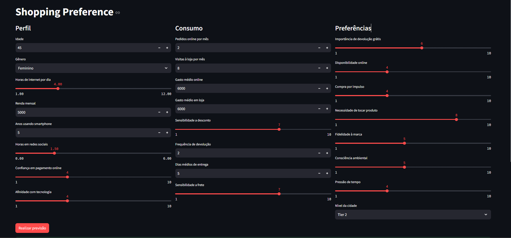
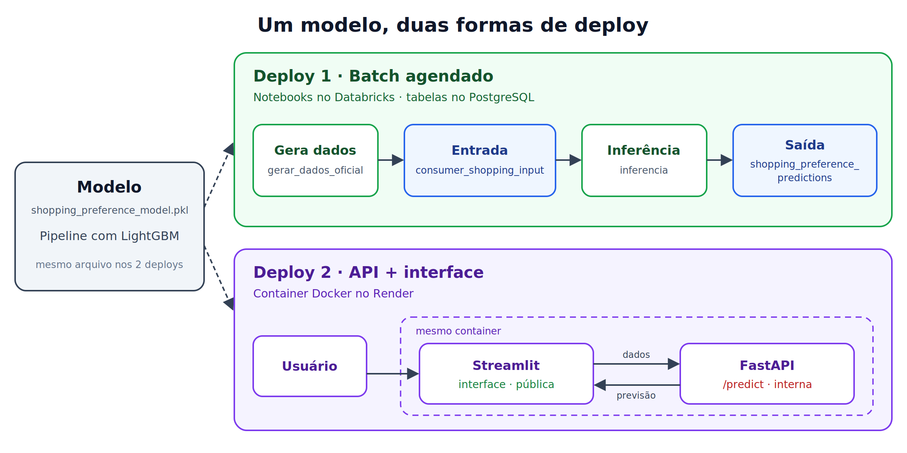
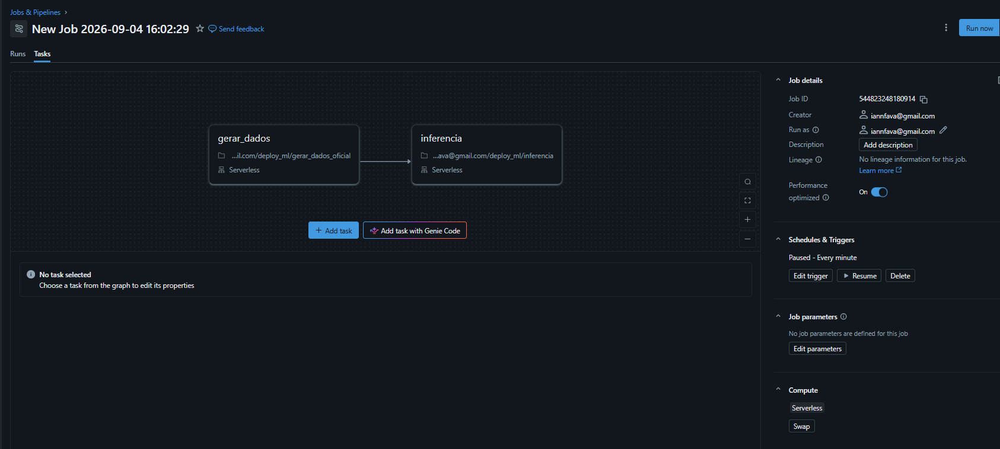
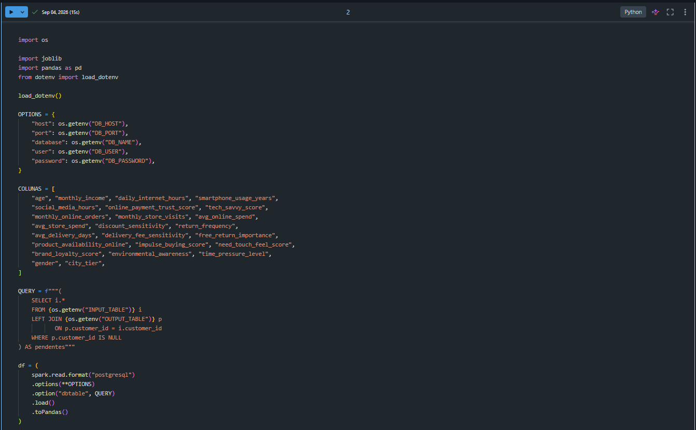
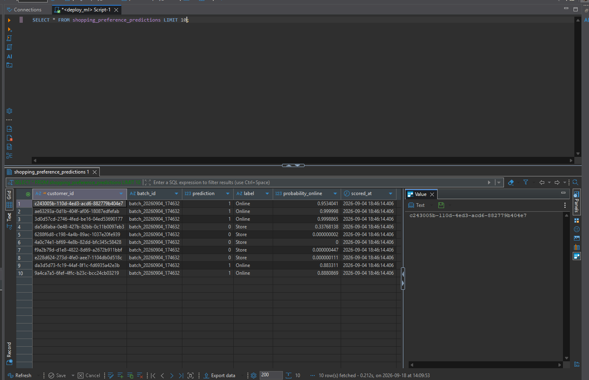
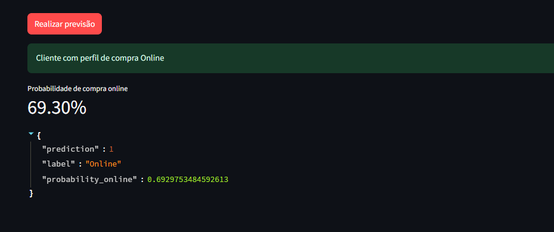
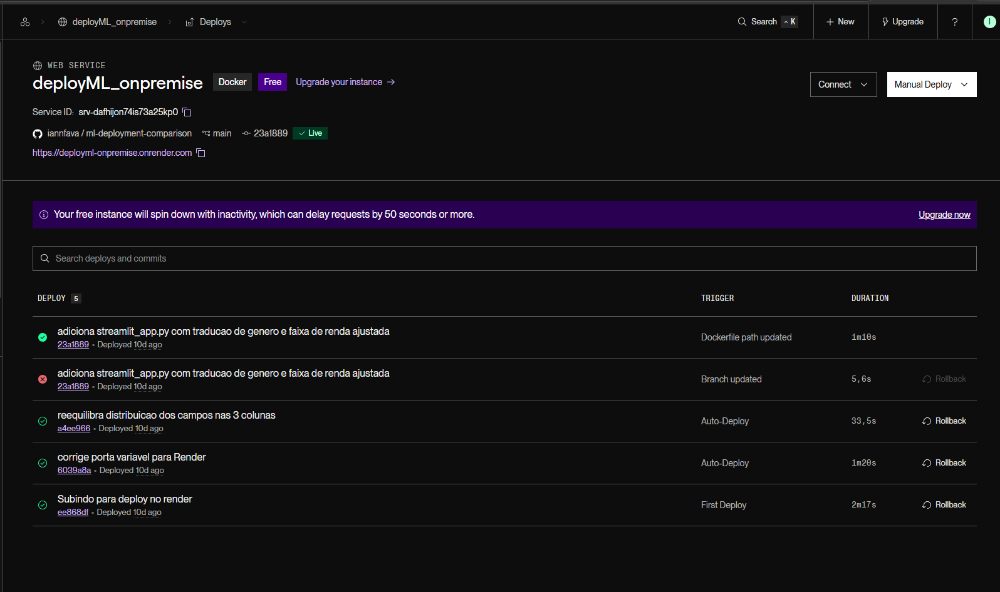

# Deploy de Modelo de Machine Learning: Batch vs. API

Comparação prática de dois padrões de deploy para o mesmo modelo de classificação (LightGBM): **inferência batch agendada** no Databricks, lendo e gravando em PostgreSQL, e **inferência online** via API FastAPI com interface Streamlit, empacotadas em Docker e publicadas no Render.

O foco é a camada de deploy (empacotamento, configuração por ambiente, controle de versões e operação dentro dos limites de planos gratuitos), não a modelagem. 

🔗 **[Interface ao vivo](https://deployml-onpremise.onrender.com)**: instância gratuita; após um período parada, a primeira requisição pode levar cerca de 1 minuto.



---

## 1. Problema

Um pipeline scikit-learn prevê se um cliente tem perfil de compra **Online** (1) ou em **Loja física** (0), a partir de 24 variáveis comportamentais e demográficas.

```
24 colunas
   ├─ 22 numéricas      → passthrough (entram sem transformação)
   └─ gender, city_tier → TargetEncoder
                ↓
          LGBMClassifier
```

Ter o modelo treinado não é o mesmo que ter o modelo em produção. O mesmo `.pkl` foi implantado de 2 formas, cada uma para um cenário diferente:

| Deploy | Cenário | Status |
|---|---|---|
| **1. Batch (Databricks)** | Pontuar muitos clientes de uma vez, sem precisar de resposta imediata | ✅ Executado e validado entre 04 e 08/09/2026 |
| **2. API + Interface (Docker → Render)** | Uma previsão por vez, na hora | ✅ Interface pública no ar |

---

## 2. Arquitetura



| | Batch (Databricks) | API + Interface (Render) |
|---|---|---|
| Quando a previsão fica pronta | Na próxima execução do job | Na hora da requisição |
| Ambiente | Databricks Free Edition, computação Serverless | Render plano Free, 1 container Docker |
| Limite do plano gratuito | Cota de computação: ao estourar, o job para (ver [o que aconteceu](#o-agendamento-parou-em-0809)) | A instância "dorme" quando fica parada |
| Peças para manter | Job com 2 tarefas dependentes + banco externo | 1 container com 2 processos |
| Quando usar | Muitos registros, sem urgência | Uso interativo, um cliente por vez |

**O que se repete nos 2 deploys:**

- **O pré-processamento está dentro do `.pkl`.** O `TargetEncoder` faz parte do pipeline salvo, então nenhum deploy reimplementa o encoding. Isso evita *training/serving skew*, que é quando o dado em produção é transformado de um jeito diferente do treino e o modelo erra sem dar erro.
- **É o mesmo arquivo.** O hash SHA256 do `.pkl` é idêntico nas pastas dos 2 deploys.
- **O modelo é carregado uma vez só.** Na API, o `joblib.load` fica no escopo do módulo e roda quando o servidor sobe, não a cada requisição. No batch, ele carrega uma vez por execução.
- **Configuração vem do ambiente:** credenciais no `.env` (fora do Git), porta via `$PORT` e endereço da API via `API_URL`.

**O que é diferente: controle de versões.**

- No **Deploy 2**, eu controlo o ambiente inteiro. A imagem usa `python:3.10-slim` e o `requirements.txt` fixa as versões do treino: scikit-learn 1.7.1, lightgbm 4.6.0, pandas 2.2.3, numpy 2.2.6 e joblib 1.5.1.
- No **Deploy 1**, o ambiente é gerenciado pelo Databricks Serverless. Só consegui fixar o LightGBM (`pip install lightgbm==4.6.0`), e o resto veio da plataforma (Python 3.12, numpy 2.1.3). Funcionou, mas não é o ambiente exato do treino. É o trade-off entre controle e conveniência.

---

## 3. Stack

**Deploy 1 (Batch):** Databricks (Jobs, Serverless) · Spark · PostgreSQL (Render) · pandas · joblib

**Deploy 2 (API + Interface):** FastAPI · Pydantic · Uvicorn · Streamlit · Docker · Render

**Modelo:** scikit-learn · LightGBM

---

## 4. Implementação

### Modelagem

Há 2 modelos no repositório, e só um está em produção:

| Arquivo | Classificador | Origem | Uso |
|---|---|---|---|
| `01_…/` e `02_…/shopping_preference_model.pkl` | LGBMClassifier | Fornecido pelo curso | **Produção** nos 2 deploys |
| `models/shopping_preference_pipeline.pkl` | HistGradientBoostingClassifier | Gerado pelo meu notebook em `00_modelagem/` | Só referência, nunca implantado |

O modelo de produção veio pronto. Não tenho o notebook de treino dele, só o próprio arquivo. Inspecionando o `.pkl`, dá para ver o pipeline e os hiperparâmetros (`n_estimators=500`, `num_leaves=15`, `class_weight='balanced'`).

**Por que as numéricas passam sem padronizar:** modelos de árvore, como o LightGBM, decidem por cortes do tipo "idade > 35?", e a escala do número não muda onde o corte cai. Por isso o pipeline de produção usa `passthrough`.

No notebook de `00_modelagem/`, refiz o processo completo:

| Etapa | O que faz |
|---|---|
| Split | 20% separados como holdout desde o início |
| EDA | Tipos, valores faltantes e relatório sweetviz |
| Baselines | Regressão Logística, HistGradientBoosting e MLP |
| Encoders | TargetEncoder, OneHotEncoder e OrdinalEncoder |
| Tuning | RandomizedSearchCV (20 combinações × 5 folds) |
| Threshold | Testado de 0.3 a 0.7 |
| Exportação | Pipeline completo salvo com joblib + checagem `np.allclose` após recarregar |

Detalhes em [`models/README.md`](models/README.md).

### Deploy 1: Batch agendado (Databricks)

Um job com 2 tarefas em sequência, rodando em computação Serverless:



1. **`gerar_dados`** ([`gerar_dados_oficial.ipynb`](01_deploy_batch_databricks/gerar_dados_oficial.ipynb)) gera 100 clientes **sintéticos** (valores sorteados com numpy) e grava em `consumer_shopping_input`.
2. **`inferencia`** ([`inferencia.ipynb`](01_deploy_batch_databricks/inferencia.ipynb)) lê **só os clientes que ainda não têm previsão**, pontua e grava em `shopping_preference_predictions`.

A leitura incremental é o que permite rodar o job repetidamente sem pontuar o mesmo cliente duas vezes:

```sql
SELECT i.*
FROM consumer_shopping_input i
LEFT JOIN shopping_preference_predictions p
       ON p.customer_id = i.customer_id
WHERE p.customer_id IS NULL
```

Se não houver nada pendente, o notebook encerra sem chamar o modelo. A leitura e a escrita no Postgres usam o conector nativo do Spark (`spark.read/write.format("postgresql")`).



**Resultado, conferido direto no banco:**

| Métrica | Valor |
|---|---|
| Previsões gravadas | 161.200 |
| Execuções bem-sucedidas | 1.612 (100 clientes cada) |
| Clientes gerados × pontuados | 161.200 × 161.200 (nenhum pendente, nenhum duplicado) |
| Período | 04/09 a 08/09/2026, mais 1 execução em 18/09 |



#### O agendamento parou em 08/09

O job estava agendado **a cada minuto**, como demonstração. Em produção real, faria sentido rodar uma vez por dia. Ele funcionou de 04 a 08/09 e depois todas as execuções passaram a terminar com status **Evicted**:

- a execução **nunca começava**: ficava 48 horas na fila esperando computação e era descartada;
- a tarefa `inferencia` aparecia como *Upstream evicted*, porque depende da `gerar_dados`.

A causa mais provável é o **estouro da cota de computação do Databricks Free Edition**, que desliga a computação do workspace quando o limite é atingido. Não consegui confirmar pelo log: quando fui investigar, o Databricks já tinha apagado os eventos, porque ele só guarda 14 dias. O agendamento está pausado.

### Deploy 2: API + interface em container (Docker → Render)

FastAPI serve o modelo e o Streamlit é a interface. Os dois rodam **no mesmo container**:

```dockerfile
FROM python:3.10-slim
ENV PYTHONUNBUFFERED=1 PORT=8501
RUN apt-get update && apt-get install -y --no-install-recommends libgomp1 \
    && rm -rf /var/lib/apt/lists/*
...
CMD uvicorn app:app --host 0.0.0.0 --port 8000 & \
    streamlit run streamlit_app.py --server.port ${PORT} --server.address 0.0.0.0 --server.headless true
```

- **FastAPI** (`app.py`) roda na porta 8000, com `GET /health` e `POST /predict`. A entrada é validada por um modelo Pydantic: um campo faltando ou de tipo errado retorna erro 422 antes de chegar ao modelo.
- **Streamlit** (`streamlit_app.py`) roda na porta `${PORT}`, que é a única porta que o Render expõe. Ele chama a API pelo endereço em `API_URL`, que por padrão é `http://127.0.0.1:8000`, o próprio container.
- **Por isso a API não é pública:** quem acessa o link usa a interface, e a interface usa a API internamente.
- **`libgomp1`:** o LightGBM depende da biblioteca OpenMP (`libgomp`), que não vem na imagem `python:3.10-slim`.
- **`${PORT}` com padrão 8501:** rodando local, usa 8501. No Render, a plataforma define a porta e só encaminha tráfego para ela. O primeiro deploy subiu com a porta fixa, e o commit seguinte ("corrige porta variavel para Render") trocou para `${PORT}`.





---

## 5. Resultados, limitações e próximos passos

**Resultados**
- Deploy 1: 161.200 previsões gravadas em 1.612 execuções agendadas, sem duplicatas.
- Deploy 2: interface pública no Render, respondendo previsões via API interna.
- O mesmo `.pkl` (hash idêntico) nos dois deploys, sem reimplementar o pré-processamento.

**Limitações conhecidas**
- Os dados do Deploy 1 são **sintéticos** e sorteados coluna por coluna. Eles provam que o pipeline funciona, não que as previsões são boas.
- A API do Deploy 2 não está exposta publicamente, e os 2 processos no mesmo container não têm supervisão: se a API cair, a interface continua no ar sem ela.
- No Deploy 1, só o LightGBM tem versão fixada.
- O Postgres gratuito do Render expira em 04/11/2026. Os prints e as consultas acima ficam como registro do Deploy 1.

**Próximos passos**
- [ ] Separar API e interface em 2 serviços no Render, deixando a API pública.
- [ ] Reagendar o job para 1 execução diária.
- [ ] Trocar o `.env` no Databricks por Databricks Secrets.
- [ ] Fixar scikit-learn e pandas também no Deploy 1.
- [ ] Medir latência do Deploy 2 (com e sem cold start).

**Aprendizados**

<!-- Escrever com as próprias palavras. -->

---

## Estrutura do repositório

```
├── 00_modelagem/                 # notebook de modelagem refeito + dataset
├── 01_deploy_batch_databricks/   # notebooks do job, DDL e o .pkl
├── 02_deploy_api_container/      # app.py, streamlit_app.py, Dockerfile, requirements.txt e o .pkl
├── models/                       # modelo de referência (HistGradientBoosting), não usado em produção
├── docs/images/                  # diagrama e prints
└── notas.md                      # diário de bordo
```
